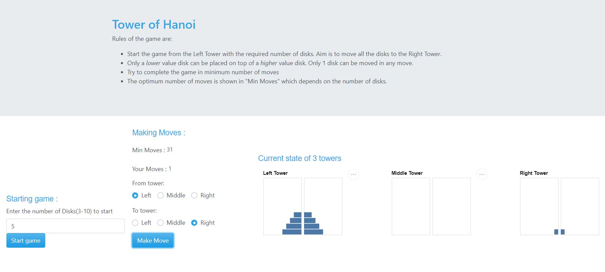
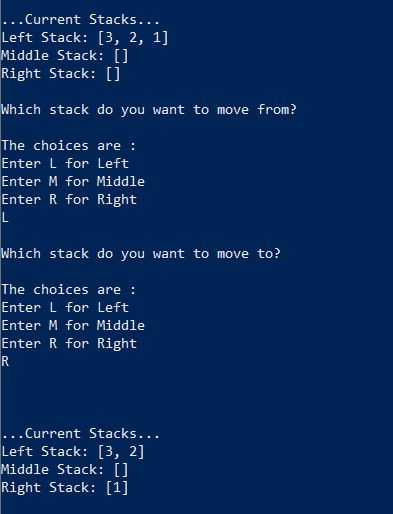

# Tower_of_Hanoi_Dash_app

### Author
1. Saurav Chowdhury

### Description
This is a simple Dash app to play the tower of hanoi game. The game is a simple application of stacks in the backend of a dashboard. The game can be played from the link [here](). Also you can clone/download the repo and run the app.py script to play the game.

Rules of the game are:

- Start the game from the Left Tower with the required number of disks. Aim is to move all the disks to the Right Tower.
- Only a *lower* value disk can be placed on top of a *higher* value disk. Only 1 disk can be moved in any move.
- Try to complete the game in minimum number of moves
- The optimum number of moves is shown in "Min Moves" which depends on the number of disks.

Here is a screenshot of the game:

The game can also be played on command line using the "src/game_script.py" file. Well this is not fun at all!!

This is how it looks on command line:

**Credits**
The code for stack and node class was created with help of [codeacademy_Computer_Science_course](https://www.codecademy.com/learn/paths/computer-science)
